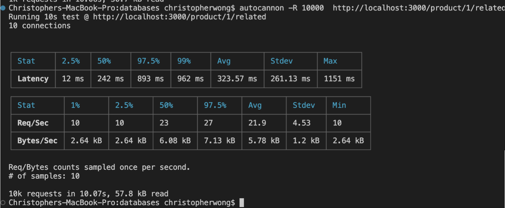
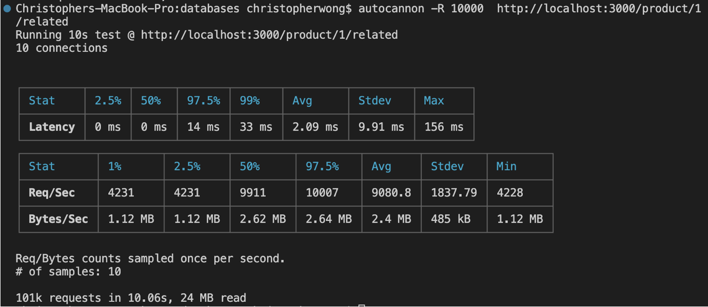

# DolchyGabanna

A Backend Optimized Retail Web Portal Design for the Products section

## Tech Stack

## Installation
1. git clone from DolchyGabnna repo
1. In your terminal, run 'npm install'
1. In your terminal, run 'npm start'

## Before Optimization

## After Optimization

